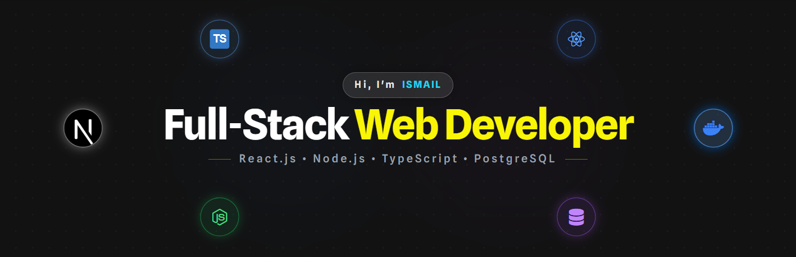

<!-- Banner -->

<h1 align="center">Ismail Hossain</h1>

  Full-Stack Web Developer  
   
  React • Next.js • TypeScript • Node.js • MongoDB • PostgreSQL

  

---

<!--- About Me --->

## 👋 About Me

Hi, I’m **[@Ismail Hossain](https://github.com/ismaileub)** – a passionate Full-Stack Web Developer.

- 🖥️ Currently working on **React.js, Next.js, TypeScript and Redux** for frontend development.
- 🗄️ Using **Node.js, Express.js, MongoDB, Mongoose, PostgreSQL and Prisma** for backend development.
- 🛠️ Currently learning **GraphQL, Docker and AWS** to expand my skill set.
- 💬 Ask me about **Full-Stack Development (React, Next.js, Node.js, Express, MongoDB, PostgreSQL)**.
- 🌐 Explore my Portfolio: **[Ismail Portfolio](https://ismail-portfolio-beta.vercel.app)**
- 📄 Download my Resume: **[Resume PDF](https://drive.google.com/uc?export=download&id=YOUR_RESUME_ID)**
- 📫 Feel free to reach out via **[Email](mailto:ismail301515@gmail.com)**

## 🌐 Connect With Me

  
  
  

---

## 👨‍💻 Career Overview

Full-Stack Web Developer experienced in developing scalable and secure web applications using modern JavaScript technologies.  
Strong understanding of frontend architecture, backend development and database design.

Focused on writing clean code, building maintainable systems and delivering real-world solutions.

---

## 🧰 Tech Stack

### Frontend

  

### ⚙️ Backend

  

### 🗄️ Database & ODM / ORM

  

### 🎨 UI / UX Design

  

### ☁️ Deployment Platforms

  

### 🛠 Tools & Environment

  

---

## 🧠 Coding Profile

- [Codeforces](https://codeforces.com/profile/ismail-eub)
- [CodeChef](https://www.codechef.com/users/ismaileub)
- [Beecrowd](https://judge.beecrowd.com/en/profile/907824)

---

## 📈 GitHub Contributions

  

## 📊 GitHub Activity

  
  

<!-- 

  

 -->

---

## 📫 Contact

📧 **Email:** ismail301515@gmail.com  
🌐 **Portfolio:** https://ismail-portfolio-beta.vercel.app/  
💼 **LinkedIn:** https://www.linkedin.com/in/ismail-eub

---

  

